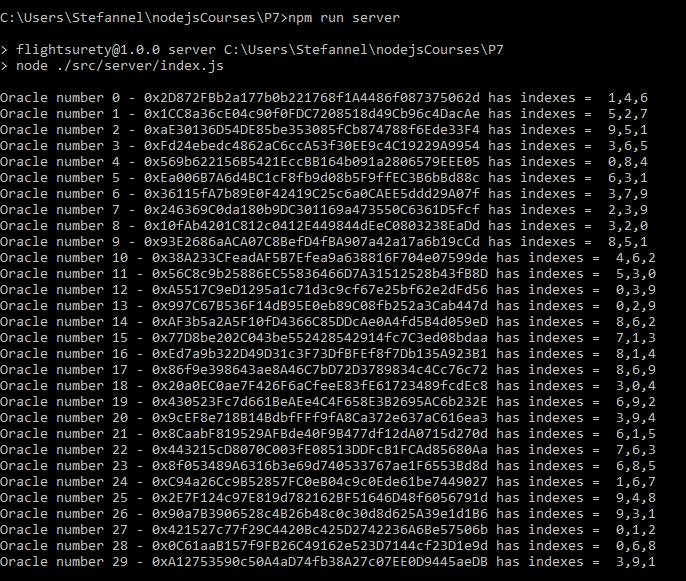
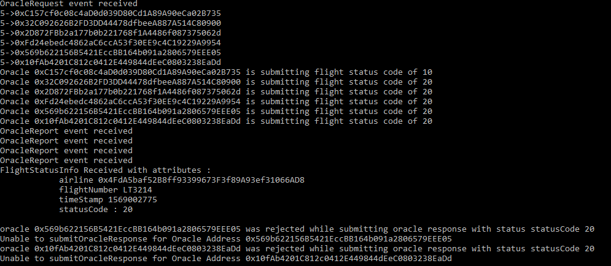

# Project 7: Architect and develop a Flight Surety Dapp 
## Concept and explanation
Seventh project for Blockchain NanoDegree that requires to create a DApp flight surety solution backed by the Ethereum platform. Also requires to architect smart contracts to have a clear separation between Data and Logic (Application)

The front-end of the application runs on the client's machine, powered by a lite-server. Using web3/metamask , it communicates with the deployed smart contract from Local Ganache EVM. Also, there is an expressJs(nodejs) server that runs in order to simulate the answers for oracles for fetching the flight status.

The UI is similar with the UI from Project 6 - SupplyChain but has been adapted for this specific project.

## GUI Overview


## GUI Explanation (also contains info about how to use the APP)

### 1. Contract Administration (owner/admin)
#### 1.1 Fields
- `Deployed App Contract Address` The address of the local ganache deployed App contract
- `App Contract Operational Status : • Operational | • Not Operational` Indicate the status of the App Contract (paused or not paused). Clicking on `Get AppContract Status` OR `Set AppContract status` will read and set the status. Requires owner rights.
- `Data Contract Operational Status : • Operational | • Not Operational` - same as above but for Data Contract
- `Authorize Data Contract to use App Contract Address:` This will take the inserted address and try to authorize it on Data Contract. It is populated by default by `Get AppContract Address` button
#### 1.2 Buttons
- `Get AppContract Address` Will read the App contract address and populate the fields `Deployed App Contract Address` and `Authorize Data Contract to use App Contract Address:`
- `Get AppContract Status` - will read the app contract status and populate one of the two radio buttons of `App Contract Operational Status`: `Operational` or `Not Operational`
- `Set AppContract Status` Requires owner role. Will read the selected radio button of `App Contract Operational Status` and try to change (pause or unpause) the contract.
- `Get DataContract Status` Requires owner role. Acts similar as `Get AppContract Status`
- `Set DataContract Status` Requires owner role. Acts similar as `Set AppContract Status`
- `Authorize AppContract to DataContract` Requires owner role. Reads the address from `Authorize Data Contract to use App Contract Address` field and attempts to authorize it for the Data Contract.
 
### 2. Airline
#### 2.1 Fields
- `Airline Address` Input address to register OR VOTE a new airline. Used in `Register/Vote Airline`
- `Airline Name` Input airline name to register a new airline. Used in `Register/Vote Airline`
- `Fund Airline` - Value in Ether to fund a freshly registered airline. Used in `Fund Airline`
- `Flight Number` Flight number to register a new flight for the current selected (metamask account) airline. Used in `Register new Flight`
- `Flight time` int value of the timestamp to register when the new flight will happen. 
#### 2.2 Buttons
- `Register/Vote Airline` [From Validated Airline] Attempts to register or vote for the new airline from `Airline Address`. If less than 5 airlines, it will register the airline. If 5+ more alirlines exist, it will act as a vote for that airline. In order to register/vote that specific airline, change the metamask account to another one (that is a funded airline) and click on `Register Airline` to vote for it. If registration is succesful, the event AirlineRegistered is triggered with the number of votes. 
- `Fund Airline` [From freshly Registered Airline] Allows the freshly registred airline to fund itself. Will read the value from `Fund Airline` field. If the airline is only registered, this will also trigger its validation. If it's already validated, it will just increase its money-pot.
- `Register new flight` [From Validated Airline] Will read the values from `Flight number` and `Flight time` and register a new flight. The current metamask account acts as the current airline that wants to register the flight.
 
### 3. Passenger - buy insurance
#### 3.1 Fields
- `Select flight` Dropdown that shows all the registered flights. Populated by `Get Flights`. Always use `Get Flights` if you register a new flight to refresh this dropdown list
- `Flight Company Address` The address of the flight company operating the selected flight.
- `Flight time` - the time of the selected flight
- `Flight status` The status of the selected flight. (0 -unknown, 20 delayed etc). Should get refreshed when you select a flight from `Select flight` dropdown. 
- `Insurance amount (max 1 ether/1000 finney` The amount to be paid for the insurance for that flight in finney
#### 3.2 Buttons
- `Get Flights` Populated the list of available flights in the `select flight` drop down. Please use this each time a new flight is registered
- `Buy insurance` buys insurance for the selected flight and for the selected finney / `Insurance amount`. Warning: max 1000 finney and ONLY 1 INSURANCE/passenger. One passenger cannot buy 2 insurances for the same flight.

### 4. Oracles and payout insurance
#### 4.1 Fields
- `Select flight` Dropdown that shows all the registered flights. Populated by `Get Flights`. Always use `Get Flights` if you register a new flight to refresh this dropdown list
- `Flight Company Address` The address of the flight company operating the selected flight.
- `Flight time` - the time of the selected flight
- `Flight status` The status of the selected flight. (0 -unknown, 20 delayed etc). Should get refreshed when you select a flight from `Select flight` dropdown. 
- `Amount to withdraw` If the passenger has any credit for the selected flight, that available credit will be displayed in this field.
#### 4.2 Buttons
- `Check Flight Status` Requires owner role. For the selected flight, triggers the OracleRequest event and the expressJS will feed random responses (70% chance of reply 20 - delayed and 30% to reply random [0,10,30,40,50]).
At this stage, the expressJs server will display the submitted replied and the transaction history from the screen bottom will display the events. If flight is delayed, then the balance of each passenger with insurance is credited and passenger can see his balance/credit on the `amount to withdraw` (and using passenger metamask account).
- `Withdraw` For passenger only. Allows for the passenger to withdraw his credit for his insurances. On data contract, each passenger has a credit balance (map) and each time a flight is delayed, the balance will be credited. If passenger has bought 2 insurances (1 eth each) for 2 different flights and both are delayed, his credited balance will be 3 ether (1.5 x2) and `Amount to withdraw` will display this fact. Using withdraw,  

## Using the APP
### Application logic overview and tips and extra features added
- The current selected Metamask account will the transaction originator. If the current metamask account is not an airline, it won't be able to use fund option (and so on)
- As application starts for the first time, The AppContract it not authorized to use DataContract. The default Metamask account will need to `Get AppContract Address` -> `Authorize AppContract to DataContract`
- When starting for the first time, there are NO REGISTERED flights and only one registered airline (owner-account[0]) but not funded. The user will have to fund that airline and register few flights and/or few more airlines.
- The airline registration process is Airline1 (validated airline) will input another account/address and register(or vote for) that address to be an airline.
- The default account (accounts[0]) is the owner of both contracts and the first registered airline (but not funded). It will need to `Fund` before registering a new airline or a flight.
- The multi-party consensus is enforced on airline registration. If <4 airlines, register airline will register the new airline. If >4 airlines, the user will have to use 2 or more validated airline accounts and register the same new airline in order to make it registered. (simply just register new airline (account2), swap to metamask account2 and `Fund`).
- Many imnportant functions trigger events. They can be seen at the bottom of the page.
- When an airline is successfully registered, it will trigger an event AirlineRegistered (votes).
- Flight number should be unique as it also acts as an identifier. 
- After registering a flight or when wishing to refresh the list of flights, please use `Get Flights`. 
- Selecting one flight from the drop down (after using `Get Flights`) will populate the fields time/address/status with the flight's status. If the UI glitches, please Click on `Get flights` then select that flight again.
- `Check flight status` is restricted for owner only. The logic is that probably we don't want all the passengers to Fetch flight status and cause expensive oracles communication. Only an authorized user should do it (eg: owner).
- The expressJs starts 20 oracles. Upon their random assigned index (usually 4-7 oracles have the matching index of the flight status index request) they have a 70% probability to return 20 and 30% probability to return (0,10,30,40,50). 
- Remember to switch to the passenger's (insured) account and select that flight again in order to see how much you can withdraw after a successful `Check flight status`.
- Before and after using withdraw as passenger, verify the metamask balance to see if the balance has been transferred.
- Due to random indexes, some truffle tests might fall as not enough matching indexes-oracles exist. 
- Please also enable the console as it logs useful info. Also remember to watch the Transaction History from the bottom of the page.
- As a "extra feature" the app provides a logic to protect "bad airlines" to drain the funds from the contract due to insurance payouts. Thus, each airline and passenger have separate balances. Based on the individual balance, an insurance "delta/multiplier" is calculated. EG: if airline has 10 eth as fund/balance and 8 passengers bought insurance, then the app will see it's not possible to refund 12 eth (8 x 1.5 = 12 > 10). At this stage, the app will calculate a multiplier that will cause the returned insurance not to go over 10 (so multiplier will be set to 1.2x for this flight payout). The default starts of 1.5 and if total payouts exceed the airline's available balance, it will drop to 1.4, 1.3 and so on till 1.0.

### Using the app
#### These notes provide a basic quick run/guide of the app for the very first time after ganache-cli started.
1. Logged on MetaMask account[0] (owner) `Get Application Address` -> `Authorize AppContract to DataContract`.
2. From same account -> `Fund airline`. Now the owner/account1 will be a valid airline. 
- At this stage this account is a validated airline and can register new airlines. To do so, just copy paste the address of metamask account2 into the `Airline Address`, add some Airline Name and click on Register/Vote Airline. Now swap to account2 on metamask and click on `Fund Airline`. This makes account2 a validated airline. Rinse and repeat until you have 4 validated airline. At this stage, you can register a 5th by pasting the address of account5 and select `Register/Vote Airline` then swap to another validated airline/account and click on `Register/Vote Airline`. Thus, 2 different airlines have registered (voted) this new 5th airline and this will cause account5 to become registered airline. This fact should be visible in the Transaction History (Event History)
3. Fill up the `Fligh Number` and `Flight time` and `Register new flight.`. You can register another flight by the same steps (make sure you change the Flight Number)
4. Swap to a different account (passenger account) and click on `Get Flights`. The drop down will be populated with the registered flights.
5. Select the desired flight, input the insurance amount (max 1000 finney) and click `Buy Insurance`.
6. Navigate to Oracles and payout insurance. Swap to owner account, select that flight and click `Check Flight Status`. The expressJS oracles should send OracleReports with ~random statuses (mostly should be 20). 
- If by any mean 3 oracles didn't send status 20 (very very low chance) the demo cannot be continued for that flight as the app has a build-in mechanism of not allowing the same oracle to submit twice response for the given flight. Thus, clicking on `Check Flight Status` for the same "unresolved" flight will reject all the oracles. A new flight from the dropdown will have to be used.
7. Swap to passenger account and reselect that flight. If the flight was "resolved" with status 20, then `Amount to withdraw` should display the 1.5 X [insurance amount] that he purchased as credit. 
8. As passenger click on `withdraw` and this will trigger the passenger available credit to be deducted and balance (wallet balance) to increase by the given amount.

## Getting Started
These instructions will get you a copy of the project up and running on your local machine for development and testing purposes. 

### Prerequisites

* [NodeJS](https://nodejs.org/en/download/current/) (The install will also include the npm node package manager)
* [ganache-cli](https://github.com/trufflesuite/ganache-cli) Fast Ethereum RPC client for testing and development
* [truffle](https://www.npmjs.com/package/truffle) Development environment, testing framework and asset pipeline for Ethereum
* MetaMask extension installed in your browser and few ethers on Rinkeby Test Network.
```
node -v
npm -v
npm i ganache-cli -g
npm i truffle -g
```

### Installing

A step by step series of examples that tell you have to get a development env running

Clone this repository:

```
git clone https://github.com/StefanelStan/flight-surety.git
```

Change directory to `P7` folder and install all requisite npm packages (as listed in `package.json`):

```
cd P7
npm install
```

## Running the tests

1. Launch Ganache-cli: It is important to use a mnemonic for the ganache-cli and the given arguments `-e 500 -a 40 -l 10000000` (40 accounts each with 500 ether. Accounts 10-39 are used for oracles and 0-9 for general usage :airlines, passengers etc). The same mnemonic will be used in Metamask to import the accounts
```
ganache-cli -m "word1 word2 word3 ....word12" -e 500 -a 40 -l 10000000 
```
2. In a separate terminal window, Compile the contracts: This will create the smart contract artifacts in folder ```build\contracts```.
```
truffle compile
```
3. Run the test command
```
npm run test
```
All 111 tests should pass. 

- Note: There are 2 big test files: `FlightSuretyDataTest.js` and `FlightSuretyAppTest.js` to test the behavior of the App and Data contract. The oracles test behavior is included in the `FlightSuretyAppTest` test.
- Note: The oracles bit of testing might randomly fail due to the fact that less than 3 oracles have been found for the given flight status index. They have a fail-fast mechanism `Test failed as less than 3 oracles have the correct index`.  If this should happen, relaunch the command `npm run test`.


## Launching the APP
1. Launch Ganache-cli: It is important to use a mnemonic for the ganache-cli and the given arguments `-e 500 -a 40 -l 10000000` (40 accounts each with 500 ether. Accounts 10-39 are used for oracles and 0-9 for general usage :owner, airlines, passengers etc). The same mnemonic will be used in Metamask to import the accounts
```
ganache-cli -m "word1 word2 word3 ....word12" -e 500 -a 40 -l 10000000 
```

2. Compile & Deploy the contracts: In a separate terminal window deploy the contracts on ganache development network 
```
truffle.cmd migrate --network development
```
3. In the same (or a new terminal) launch the dapp
```
npm run dapp
```
Your terminal should look something like this:


4. start the nodejs express - oracle simulation in a new terminal. At this stage, 30 oracles will request to be registered and will be listening and ready to respond to FetchFlightStatus event
```
npm run server
```
Your terminal should look something like this:



When the expressjs server reacts and oracles submit a response to a FetchFlightStatus event, the terminal should look like this



## Built With
```
Truffle v5.0.15 (core: 5.0.15)
Solidity - 0.5.2 (solc-js)
Node v10.15.3
Web3.js v1.0.0-beta.37
```
### Testing libraries
* [Chai](https://www.npmjs.com/package/chai)- BDD / TDD assertion library for node. It provides easy to read asserts and expects as well at matchers (greater, between, before, contains etc)
* [truffle-assertions](https://www.npmjs.com/package/truffle-assertions) - Additional assertions and utilities for testing Ethereum smart contracts in Truffle unit tests. Used to listen for events
* [lite-server](https://www.npmjs.com/search?q=lite-server) - Lightweight development node server for serving a web app. Used to kickstart the http server to deploy the html and js to interract with the dapp.

### Development Libraries and Tools
* [Ethereum](https://www.ethereum.org/) - Ethereum is a decentralized platform that runs smart contracts. The SupplyChain contract is deployed on Rinkeby Test Network
* [Truffle Framework](http://truffleframework.com/) - Truffle is the most popular development framework for Ethereum with a mission to make your life a whole lot easier. Used for development and testing.
* [ganache-cli](https://www.npmjs.com/package/ganache-cli) Ganache CLI, part of the Truffle suite of Ethereum development tools, is the command line version of Ganache. Used to kickstart a a evm and personal blockchain to deploy and test the contract locally.
* [web3js](https://www.npmjs.com/package/web3) Ethereum JavaScript API.
* [truffle-hdwallet-provider](https://www.npmjs.com/package/truffle-hdwallet-provider) - HD Wallet-enabled Web3 provider. Use it to sign transactions for addresses. Used in truffle.cmd for deployment of contracts
* [Visual Studio Code](https://code.visualstudio.com/) - Web editor


## Authors

* **Stefanel Stan** - [Stefanel Stan Github](https://github.com/StefanelStan)

## Special Thanks
* Author wishes to thank Stackoverflow for providing great free services and to the three online resources listed below for sharing their helpful knowledge
* Udacity Blockchain ND very helpful mentors Alvaro and DanielA

## License

This project is licensed under the MIT License 
